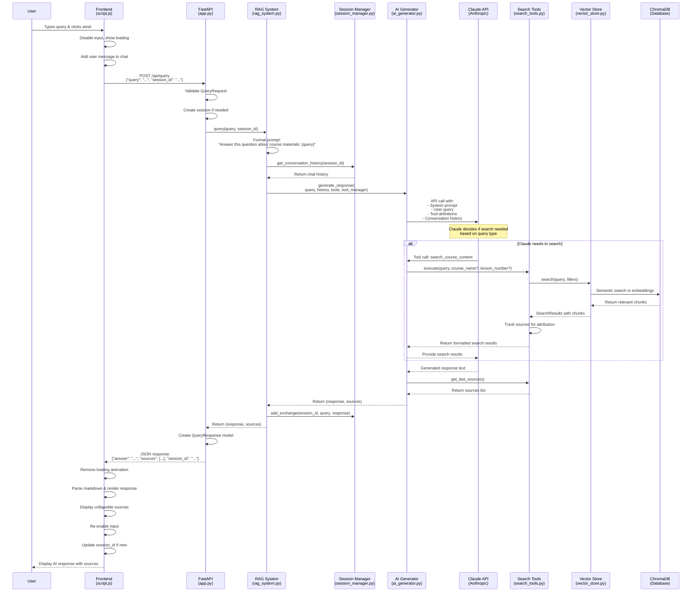
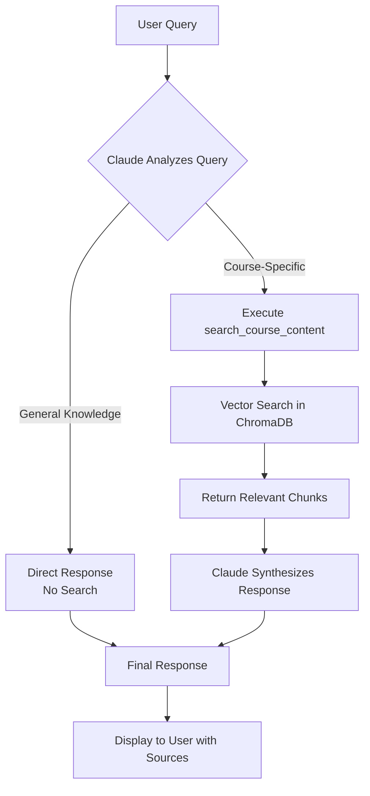

# User Query Flow Diagram

## Key Components Flow

### 1. **Frontend Layer** (`script.js`)
- User interaction handling
- API communication
- UI state management
- Response rendering

### 2. **API Layer** (`app.py`)
- Request validation
- Session management
- Error handling
- Response formatting

### 3. **RAG Orchestration** (`rag_system.py`)
- Coordinates all components
- Manages prompt formatting
- Handles conversation flow

### 4. **AI Processing** (`ai_generator.py`)
- Claude API integration
- Tool-based search decisions
- Response generation

### 5. **Search & Retrieval** (`search_tools.py` + `vector_store.py`)
- Semantic search execution
- Source attribution
- Content filtering

### 6. **Data Storage** (ChromaDB)
- Vector embeddings storage
- Similarity search
- Course content retrieval

## Tool-Based Search Decision Tree

